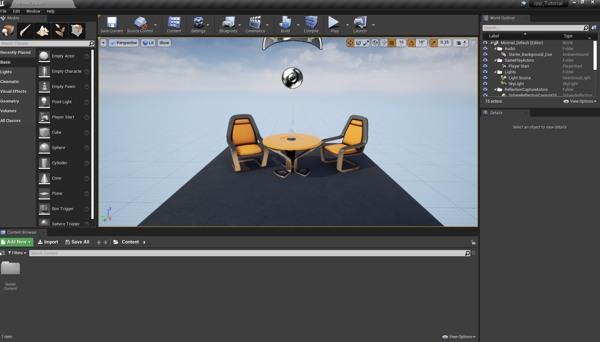
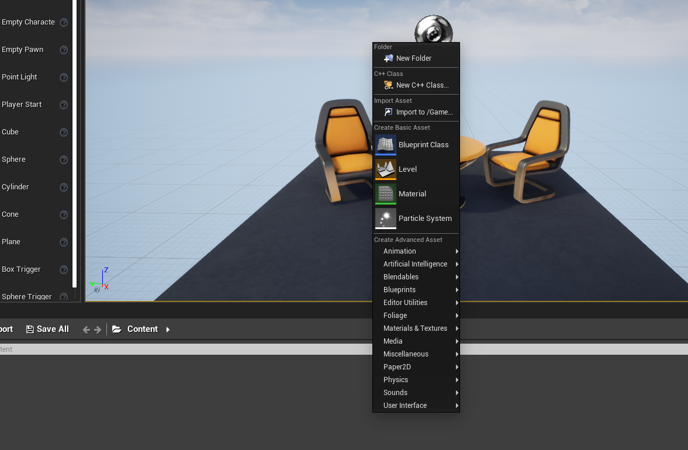
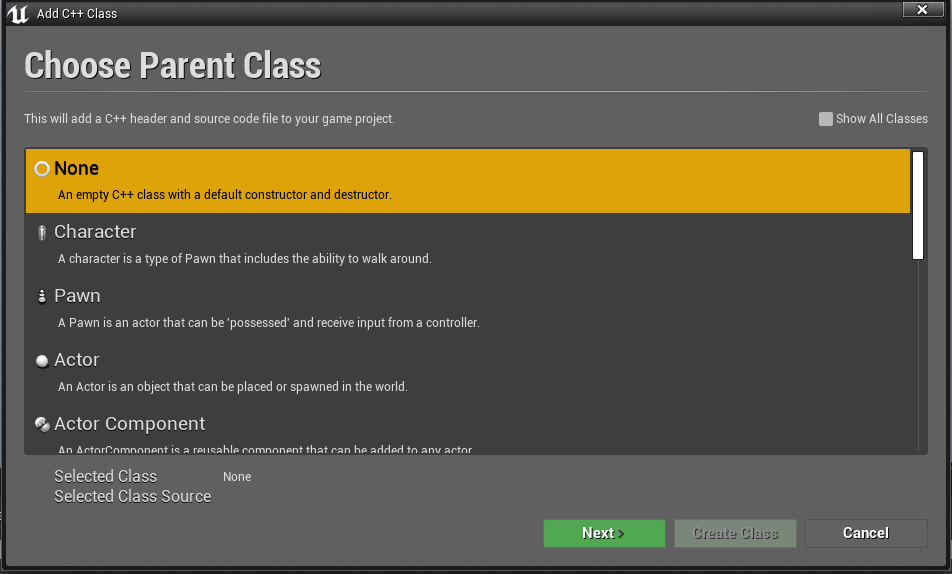

### C++ 클래스 생성


1. 처음 C++ 프로젝트를 생성하면 다음과 같은 화면이 뜬다.

    

2. 컨텐츠 탭에서 우클릭을 하면 다음과 같이 선택창이 뜨고, `New C++ Class`를 클릭한다.

    

3. ``Actor``를 클릭한다.

    

4. 해당 경로에 가면 지정한 이름으로 파일들이 생긴것을 확인할 수있다.

    ```s
    .
    ├── cpp_Tutorial.Build.cs
    ├── cpp_Tutorial.cpp
    ├── cpp_TutorialGameModeBase.cpp
    ├── cpp_TutorialGameModeBase.h
    ├── cpp_Tutorial.h
    ├── MyActor.cpp
    └── MyActor.h
    ```

5. 코드 에디터를 통해 확인해보면, ``MyActor.h``는 다음과 같이 구성되어 있다.

    ```cpp
    // Fill out your copyright notice in the Description page of Project Settings.

    #pragma once

    #include "CoreMinimal.h"
    #include "GameFramework/Actor.h"
    #include "MyActor.generated.h"

    UCLASS()
    class CPP_TUTORIAL_API AMyActor : public AActor
    {
        GENERATED_BODY()
        
    public:	
        // Sets default values for this actor's properties
        // 변수의 기본값 설정
        AMyActor();

    protected:
        // Called when the game starts or when spawned
        // 액터가 배치된 월드에서 게임이 시작되거나, 스폰되었을때 한번 호출되는 것으로
        // 게임 플레이 로직을 초기화 시키는데 사용
        virtual void BeginPlay() override;

    public:	
        // Called every frame
        // 매 프레임마다 한번씩 호출되는 함수, 매개변수인 DeltaTime을 통해서
        // Tick 함수가 지난번 호출된 이후로 얼마의 시간이 경과한뒤에 다시 Tick함수가 호출되었는지 시간 전달
        // 주로 게임의 로직을 처리하는데에 사용. 필요 없다면, 삭제해서 퍼포먼스 능률 향상시킬 수 있다.
        virtual void Tick(float DeltaTime) override;

    };

    ```

6. 언리얼 엔진에서 로그를 찍기 위해서 ``MyActor.cpp``를 다음과 같이 작성한다.

    ```cpp
    // Fill out your copyright notice in the Description page of Project Settings.


    #include "MyActor.h"


    // Sets default values
    AMyActor::AMyActor()
    {
        // Set this actor to call Tick() every frame.  You can turn this off to improve performance if you don't need it.
        PrimaryActorTick.bCanEverTick = true;
        // 로그를 남기기위한 매크로 함수 
        UE_LOG(LogTemp, Log ,TEXT("Constructor"))

    }

    // Called when the game starts or when spawned
    void AMyActor::BeginPlay()
    {
        Super::BeginPlay();
        UE_LOG(LogTemp, Log ,TEXT("BeginPlay"))
        
    }

    // Called every frame
    void AMyActor::Tick(float DeltaTime)
    {
        Super::Tick(DeltaTime);
        UE_LOG(LogTemp, Log ,TEXT("Tick"))
    }

    ```

7. 언리얼 에디터로 돌아가서 ``Compile`` 버튼을 누르고, 생성한 액터를 드래그해서 가져온다.

8. `Window > Developer Tools > output log`를 선택해서 출력 로그 창을 띄우고, 실행시키면 다음과 같이 로그가 찍히는것을 확인할 수 있다.

    ```s
    LogTemp: Constructor
    ...
    LogTemp: BeginPlay
    ...
    LogTemp: Tick
    LogTemp: Tick
    LogTemp: Tick
    LogTemp: Tick
    LogTemp: Tick
    LogTemp: Tick
    LogTemp: Tick
    LogTemp: Tick
    LogTemp: Tick
    ```