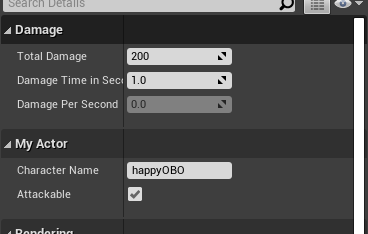

### 변수 및 UPROPERTY


1. 변수에는 정수, 부동소수점, 문자열, 불리안 등이 있다. 일반적으로 쓰는 타입과는 Unreal에서 쓰는 타입선언은 약간 다르다.
    - 예로 정수형은 이전에 주로 썼던 타입(``int``, ``short`` )은 플랫폼마다 길이가 달라질 수 있기 때문에

        ```cpp
        int8 i8;
        int16 i16;
        int32 i32;
        int64 i64;
        // 양수 버전
        uint8 i8;
        uint16 i16;
        uint32 i32;
        uint64 i64;
        ```
    - 부동 소수점 타입은 일반적인 타입과 같다.

        ```cpp
    	float f;
	    double d;
        ```
    - 문자열과 불리안은 다음과같다.
        
        ```cpp
        FString str;
        bool b;
        ```

2. 변수를 선언하기 전에 ``UPROPERTY``라는 매크로 함수를 사용한다. 이는
    - 프로퍼티가 언리얼 엔진 및 에디터에 이런 프로퍼티가 있음을 알리고
    - 연결되었을 때 어떻게 동작할지를 지정하기 위한것이다.
    - 프로퍼티가 에디터에서 보이게끔 만들려면 프로퍼티 매크로에 필요한 지정자를 넣어줘야한다.
        - ``EditAnywhere`` : 양측 모두의 창에서 편집가능
        - ``VisibleAnywhere`` : 프로퍼티를 모든 프로퍼티 창에서 보이지만, 편집할 수 없게끔한다.
        - ``BlueprintReadWrite`` : 이 프로퍼티를 블루프린트에서 읽기와 쓰기 가능
        - ``BlueprintReadOnly`` : 프로퍼티를 블루프린트에서 읽기만 가능
        - ``Transient`` : 해당 프로퍼티가 휘발성 프로퍼티로 저장되지 않음 의미
        - ``Category = "Name"`` : 블루프린터 편집 툴이나 디테일 패널에서 이 프로퍼티를 데미지라는 카테고리로 묶어서 보여준다.

3. 예시로 코드를 작성하면 ``MyActor.h``는 다음과 같다.

    ```cpp
    // Fill out your copyright notice in the Description page of Project Settings.

    #pragma once

    #include "CoreMinimal.h"
    #include "GameFramework/Actor.h"
    #include "MyActor.generated.h"

    UCLASS()
    class CPP_TUTORIAL_API AMyActor : public AActor
    {
        GENERATED_BODY()
        
    public:	
        // Sets default values for this actor's properties
        AMyActor();

        UPROPERTY(EditAnywhere, BlueprintReadWrite, Category="Damage")
        int32 TotalDamage;

        UPROPERTY(EditAnywhere, BlueprintReadWrite, Category="Damage")
        float DamageTimeInSeconds;

        UPROPERTY(BlueprintReadOnly, VisibleAnywhere, Transient, Category="Damage")
        float DamagePerSecond;

        UPROPERTY(EditAnywhere, BlueprintReadWrite)
        FString CharacterName;

        UPROPERTY(EditAnywhere, BlueprintReadWrite)
        bool bAttackable;

        

    protected:

        virtual void BeginPlay() override;

    public:	

        virtual void Tick(float DeltaTime) override;
        
    };

    ```

4. 에디터에서 컴파일 한후 액터를 끌어서 디테일 탭을 확인해 보면 다음과 같이 나타난다.

    

5. 생성자 함수를 통해 변수들을 디폴트로 초기화 시켜준다. ``MyActor.cpp`` 을 변경해보자.

    ```cpp
    #include "MyActor.h"


    // Sets default values
    AMyActor::AMyActor() 
    : TotalDamage(200), DamageTimeInSeconds(1.0f), CharacterName(TEXT("happyOBO")), bAttackable(true)
    {
        // Set this actor to call Tick() every frame.  You can turn this off to improve performance if you don't need it.
        PrimaryActorTick.bCanEverTick = true;
    }

    // Called when the game starts or when spawned
    void AMyActor::BeginPlay()
    {
        Super::BeginPlay();
    }

    // Called every frame
    void AMyActor::Tick(float DeltaTime)
    {
        Super::Tick(DeltaTime);
    }

    ```

6. 컴파일후 액터의 디테일 탭을 보면 다음과 같이 변경된것을 확인할 수 있다.

    