### 함수와 UFUNCTION


1. 기본적으로 함수 작성은 일반적인 c++에서 함수작성하는것과 동일하다. 초당 데미지의 값을 담고 있는 ``DamagePerSecond``을 계산하는 ``CalculateDPS()``를 작성해보자.

2. 먼저 ``MyActor.h``에서 함수 ``CalculateDPS()``를 선언한다.

    ```cpp
    #pragma once

    #include "CoreMinimal.h"
    #include "GameFramework/Actor.h"
    #include "MyActor.generated.h"

    UCLASS()
    class CPP_TUTORIAL_API AMyActor : public AActor
    {

        ...

    public:	
        virtual void Tick(float DeltaTime) override;

        void CalculateDPS();
        
    };

    ```

3. ``MyActor.cpp``에 함수 ``CalculateDPS()``를 추가한다.

    ```cpp
    void AMyActor::CalculateDPS()
    {
        DamagePerSecond = TotalDamage / DamageTimeInSeconds;
    }
    ```

4. 이함수를 오브젝트가 초기화 될때, 수정될때 계속적으로 부르려고한다. 
    - ``AMyActor``의 부모클래스인 ``AActor`` 에서 정의된 함수
        - `PostInitProperties()` : 언리얼 엔진에서 오브젝트가 초기화 될때 호출 되는 함수
        - `PostEditChangeProperty(FPropertyChangedEvent& PropertyChangedEvent)` : 프로퍼티가 수정될때 호출되는 함수
    - 를 상속받는 함수를 작성한다. 부모 클래스의 함수를 자식 클래스인 `MyActor`에서 덮어 쓴다는 의미로 `virtual`과 `override` 키워드를 사용한다.
    - ``MyActor.h``에서 선언을 아래와 같이 한다.
        
        ```cpp
        virtual void PostInitProperties() override;

        virtual void PostEditChangeProperty(FPropertyChangedEvent& PropertyChangedEvent) override;
	
        ```

5. ``MyActor.cpp``는 아래와 같이 작성한다.
    - ``Super`` : 클래스가 상속받은 부모 클래스에 있는 원본 프로퍼티나 함수 호출시 사용하는 키워드

    ```cpp
    void AMyActor::PostInitProperties()
    {
        Super::PostInitProperties();
        CalculateDPS();
    }


    void AMyActor::PostEditChangeProperty(FPropertyChangedEvent& PropertyChangedEvent)
    {
        
        CalculateDPS();
        Super::PostEditChangeProperty(PropertyChangedEvent);
    }


    ```

6. 컴파일 후 실행시키면 디테일 탭에서 사진과 같이 ``TotalDamage``와 ``Damage Time in Second``에 따라 ``Damage Per Second`` 가 바뀌는 것을 알 수 있다.

    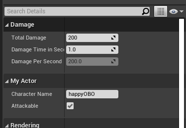

    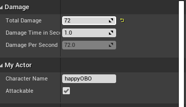

7. CalculateDPS()를 블루프린트 클래스에서 호출할 수 있게끔 만들어본다. 이 때, ``UFUNCTION()`` 매크로를 사용한다. 아래 처럼 ``MyActor.h`` 에서 ``CalculateDPS``를 선언하기 전에 해당 매크로를 호출한다.
    
    ```cpp
	UFUNCTION(BlueprintCallable, Category = "Damage")
	void CalculateDPS();
    ```
8. 유니티 에디터에서 ``MyActor``을 우클릭하고 ``Create Blueprint class based on MyActor``를 선택해서 블루프린트 클래스를 생성한다.

    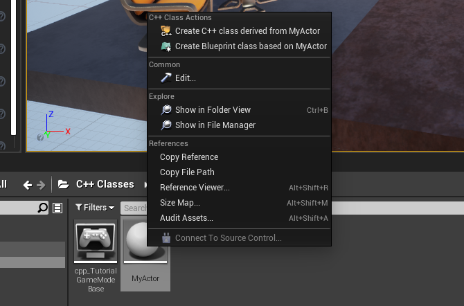
    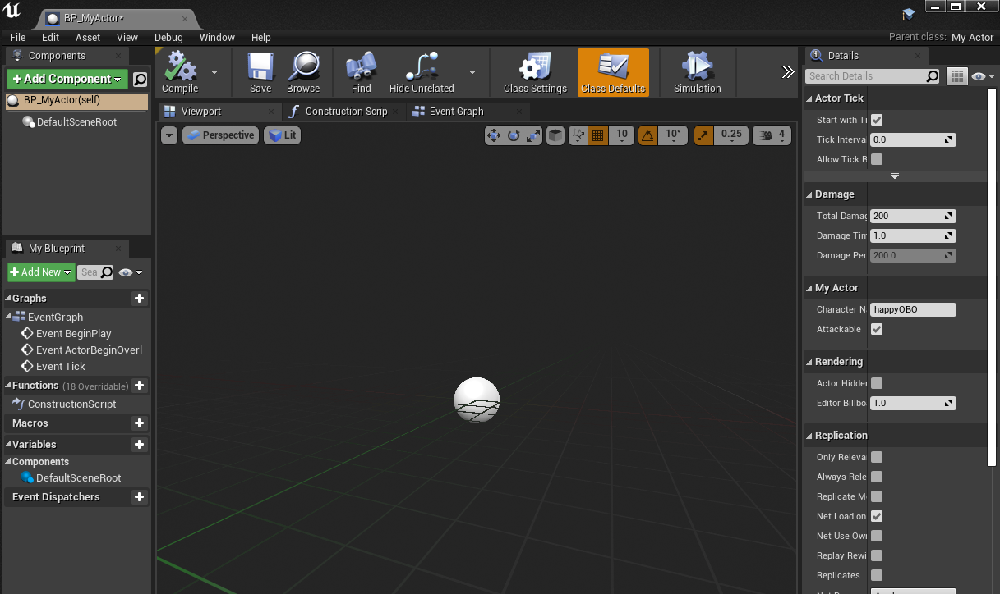

9. 이벤트 그래프에서 ``Calculate DPS`` 노드를 가져온다.

    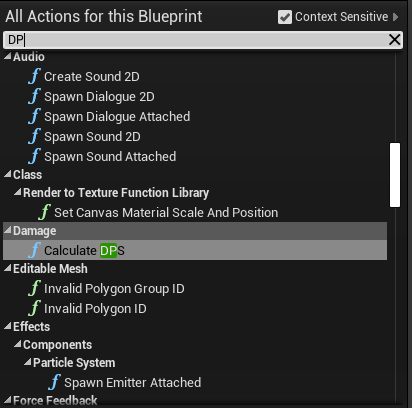

10. 아래와 같이 노드를 구성한다. 이는 ``TotalDamage``를 ``500``으로 설정하는 그래프이다.

    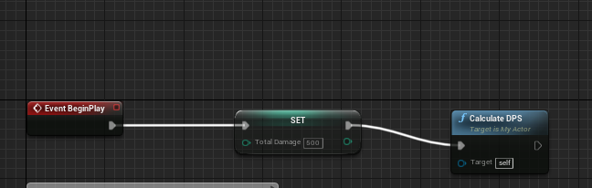

11. 컴파일 후 실행해보면 아래와같이 `500`으로 변하고, 그에 맞게 `DamagePerSecond`가 변한것을 확인할 수 있다.

    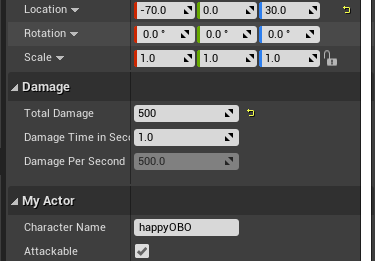


12. 또한 디자이너가 블루프린트에서 작성한 기능을 프로그래머가 `cpp`로 사용할 수 있다.

13. `MyActor.h`에 다음과 같이 선언을 해준다.
    - `BlueprintImplementableEvent` : 기능을 디자이너가 만들어야하기 때문에 함수의 본체를 만들 필요가 없다.

    ```cpp
    UFUNCTION(BlueprintImplementableEvent, Category = "Damage")
	void CallFromCpp();
    ```

14. ``MyActor.cpp`` 에서 게임이 시작할 때 처음 실행되는 ``BeginPlay``에 `CallFromCpp()` 를 끼워넣어주자.

    ```cpp
    void AMyActor::BeginPlay()
    {
        Super::BeginPlay();
        CallFromCpp();

    }
    ```

15. 컴파일 후, 언리얼 에디터에서 해당 블루프린트에서 이벤트 그래프에서 ``Event Call from Cpp`` 노드를 선택한다.

    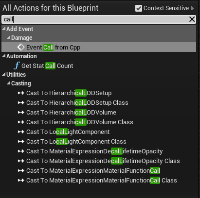

    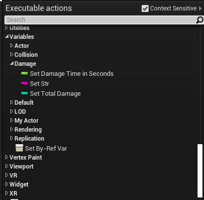

16. 문자열 "_Blueprint" 를 `append`하는 그래프는 다음과 같다.

    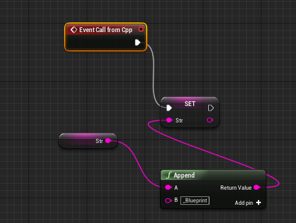

17. 컴파일 후 실행하면, ``str`` 변수에 `"test"` 에 `"_Blueprint"` 가 추가가 된것을 확인할 수 있다.

    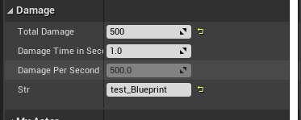


18. 블루프린트에 기능을 추가하는 방식에는 ``Blueprintimplement event`` 와 ``Blueprintnative event`` 가 있다.

    - ``Blueprintimplement event`` : 디자이너가 블루프린터로 만든 기능을 프로그래머가 원하는 시점에 cpp 코드에서 호출하는 방식 블루프린트에서 기능을 만들어두지 않으면 빈 함수를 호출하는 방식으로 동작
    - ``Blueprintnative event`` : 디자이너가 블루프린트 기능을 만들수 있게 하면서도, 만약디자이너가 블루 프린트에서 기능을 구현하지 않으면 동작할 기본 기능을 프로그래머가 cpp로 만들 수 있게 해준다.

19. 방금전까지는 ``Blueprintimplement event`` 를 했으므로 ``Blueprintnative event`` 을 사용하여, cpp에서 디폴트 기능 함수를 작성해주도록 하겠다. `MyActor.h`는 다음과 같다. cpp에서 디폴트 함수는 `CallFromCpp_Implementation()`에 작성한다.

    ```cpp
	UFUNCTION(BlueprintNativeEvent, Category = "Damage")
	void CallFromCpp();
    virtual void CallFromCpp_Implementation();
    ```

20. ``MyActor.cpp``에서 상세 `CallFromCpp_Implementation()` 내용을 작성한다.

    ```cpp
    void AMyActor::CallFromCpp_Implementation()
    {
        str.Append(TEXT("_Implementaion"));
    }
    ```


21. 컴파일 후 이벤트 그래프에 `Call From Cpp` 노드를 삭제하고 실행해보면 `str` 이 아래와 같이 변한 것을 볼 수 있다.

    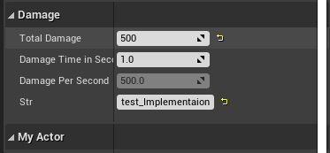

22. `Call From Cpp` 노드에서 `cpp` 기능과 블루프린트 기능을 모두 사용할 수 도 있다. `Call From Cpp` 노드에 우클릭을해서 ``Add call to parent function``을 선택한다.

    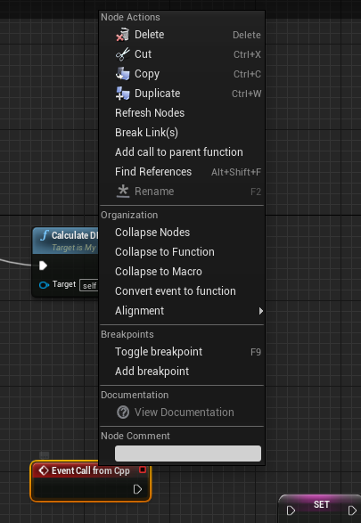

23. 다음과 같이 노드를 구성하면 `Str`이 `"test_implement_Bluprint"`로 변한것을 확인 할 수 있다.

    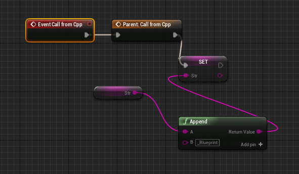

    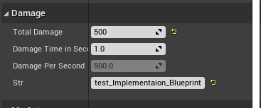

