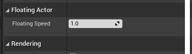

### Actor 위치 변환

1. 언리얼 기본 튜터리얼인 퀵스타터를 해본다.

2. 물체가 위에서 아래로 상하 운동을 하는것을 만들 것이다.

3. 먼저 ``FloatingActor`` C++ 클래스를 생성한다.

4. ``RunningTime``를 ``FloatingActor.h`` 에 선언한다.

    ```cpp

    #pragma once

    #include "CoreMinimal.h"
    #include "GameFramework/Actor.h"
    #include "FloatingActor.generated.h"

    UCLASS()
    class QUICKSTART_API AFloatingActor : public AActor
    {
        GENERATED_BODY()
        
    public:	
        // Sets default values for this actor's properties
        AFloatingActor();

    protected:
        // Called when the game starts or when spawned
        virtual void BeginPlay() override;

    public:	
        // Called every frame
        virtual void Tick(float DeltaTime) override;
        
        float RunningTime;

    };
    ```

5. ``FlotingActor.cpp``의 `Tick`함수에 액터의 위치를 변경하는 코드를 추가한다.
    - `FVector` : 언리얼 엔진에서 위치와 속도를 다루기 위한 타입이다.
    - `GetActorLocation()` : 액터의 현재 위치를 받아오는 함수
    - `DeltaTime` : `Tick` 함수가 언리얼 엔진 시스템에서 매개변수로 받아오는 변수로, 이전 프레임보다 얼마의 시간이 흘렀는지
    - `DeltaHeight` : 이전 높이보다 델타 시간 크기 만큼 지날때 얼마나 높아져야하는지~~sin함수만큼 위에서 아래로 운동~~
    - `NewLocation.z` : 현재 위치의 `z` 좌표
    - `SetActorLocation(NewLocation)` : `NewLocation`을 액터의 위치로 지정

    ```cpp
    void AFloatingActor::Tick(float DeltaTime)
    {
        Super::Tick(DeltaTime);

        FVector NewLocation = GetActorLocation();

        float DeltaHeight = (FMath::Sin(RunningTime + DeltaTime) - FMath::Sin(RunningTime)); 

        NewLocation.Z += DeltaHeight * 20.f;

        RunningTime += DeltaTime;

        SetActorLocation(NewLocation);
    }

    ```

6. 컴파일 후, `FloatingActor`을 가져오고, `Add component`에서 `cone`을 선택한다. 실행시 아래의 사진처럼 상하운동 하는것을 볼 수 있다.

    

    

7. 추가 적으로 블루프린트에서 움직이는 속도를 변경할 수 있는 변수를 만들려고한다. ``FloatingActor.h``에서 `FloatingSpeed` 변수를 더 추가한다.

    ```cpp
    UPROPERTY(EditAnywhere, BlueprintReadWrite)
    float FloatingSpeed;
    ```

8. ``FloatingActor.cpp``에서 `FloatingSpeed`를 초기화 해주고, ``DeltaTime``에 `FloatingSpeed`를 곱한다.

    ```cpp

    AFloatingActor::AFloatingActor()
    {

        PrimaryActorTick.bCanEverTick = true;

        FloatingSpeed = 1.0f;

    }

    void AFloatingActor::Tick(float DeltaTime)
    {
        Super::Tick(DeltaTime);

        FVector NewLocation = GetActorLocation();

        float DeltaHeight = (FMath::Sin(RunningTime + DeltaTime * FloatingSpeed) - FMath::Sin(RunningTime)); 

        NewLocation.Z += DeltaHeight * 20.f;

        RunningTime += DeltaTime * FloatingSpeed;

        SetActorLocation(NewLocation);
    }

    ```

9. 아래의 사진처럼 이제 `FloatingSpeed` 를 조절할 수 있다.

    