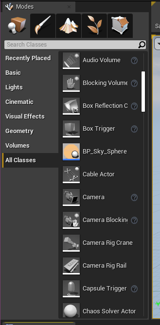
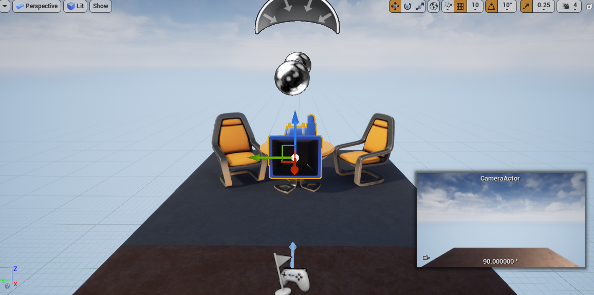
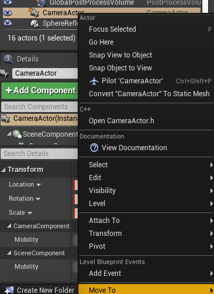
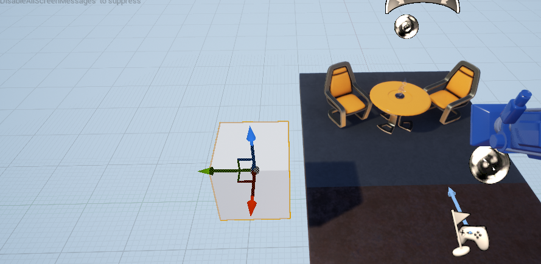
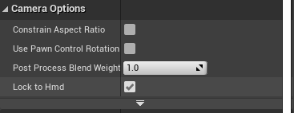
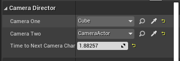
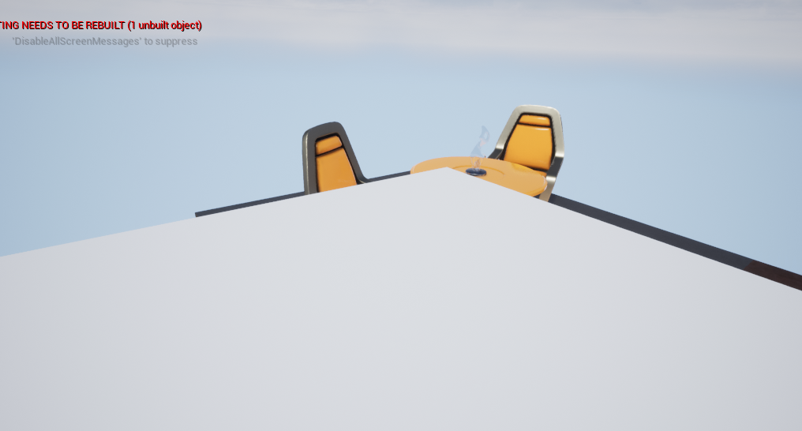
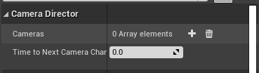

### 카메라 조종

1. 먼저 뷰포트에 카메라 액터를 생성한다. 왼쪽 탭에서 ``Camera``를 드래그하거나, 아무 액터나 놓은뒤에 ``Add Component``에서 ``Camera``를 추가하는 방법이 있다. 

    
    

2. TMI로 카메라를 움직일 때 ``Pilot 'CameraActor'`를 사용하면 편리하다.

    


3. 아무액터(큐브)를 생성한뒤 카메라를 추가하는 방법도 해보자.

    

4. ``Constrain Aspect Ratio``를 선택하면 각각의 카메라 화면 비율이 일정할 것이다.

    

5. ``CameraDirector`` 클래스를 생성하자.

6. ``CameraDirector.h``에 다음을 추가한다. 우리는 두개의 카메라를 `TimeToNextCameraChange` 마다 전환시킬 것이다.

    ```cpp
	UPROPERTY(EditAnywhere)
		AActor* CameraOne;
	UPROPERTY(EditAnywhere)
		AActor* CameraTwo;
	UPROPERTY(EditAnywhere)
		float TimeToNextCameraChange;
    ```
7. ``CameraDirector.cpp``에 `Tick`함수에 다음을 추가한다.

    ```cpp
    // Called every frame
    void ACameraDirector::Tick(float DeltaTime)
    {
        Super::Tick(DeltaTime);
        
        // 카메라의 포커스를 다음 카메라로 변경하는 시간을 정의

        const float TimeBetweenCameraChanges = 2.0f;
        
        // 카메라가 블렌딩 되며 부드럽게 전환할 시간

        const float SmoothBlendTime = 0.75f;

        TimeToNextCameraChange -= DeltaTime;

        if(TimeToNextCameraChange <= 0.0f )
        {

            TimeToNextCameraChange += TimeBetweenCameraChanges;

            // 카메라 전환 코드
            // 로컬 플레이어의 액터의 컨트롤을 처리하는 액터를 얻을 수 있다.
            APlayerController* controller = UGameplayStatics::GetPlayerController(this,0);
            if(controller)
            {
                // 이 플레이어 컨트롤러를 가져온다음, 지금 바라본 타겟이 CameraOne이 아니라면
                if((controller->GetViewTarget() != CameraOne) && (CameraOne != nullptr))
                {
                	// CameraOne을 카메라로 변경 , 바로 컷해서 전환
                	controller->SetViewTarget(CameraOne);
                }
                else if((controller->GetViewTarget() != CameraTwo) && (CameraTwo != nullptr))
                {
                	// 부드럽게 카메라를 이동시켜서 전환
                	controller->SetViewTargetWithBlend(CameraTwo, SmoothBlendTime);
                }

            }
        }
    }
    ```

8. 컴파일 후 ``CameraDirector``를 드래그해서 가져오고, ``Camera One``, ``Camera Two``를 설정한다. 실행하면 다음과같이 화면이 뜬다.

    
    
    <br>

    
    
    

9. 이제 움직이는 액터에 카메라를 추가해보자. 움직이는 액터는 ``MovingActor``라고 정하자.

10. ``MovingActor.h``에는 시간당 얼마만큼움직일 건지에 대한 변수 ``float Timer``를 추가한다.

11. ``MovingActor.cpp``에는 아래와같이 ``cos``함수를 통해 좌우로 운동하게끔 만들자.

    ```cpp
    void AMovingActor::Tick(float DeltaTime)
    {
        Super::Tick(DeltaTime);

        Timer += DeltaTime;

        FVector NewLocation = GetActorLocation();

        // 좌우로 왕복
        NewLocation.Y += FMath::Cos(Timer);
        SetActorLocation(NewLocation);
    }
    ```

12. ``MovingActor``를 드래그하고 ``Add Component``에서 카메라를 추가하면 끝!

13. 이전에는 ``CameraOne``, ``CameraTwo``를 이용해서 카메라를 여러개 생성했다. 이제는 리스트로 카메라를 받아보자. 헤더파일과 `cpp` 파일은 다음과 같다.

    ```cpp
    // CameraDirector.h
	UPROPERTY(EditAnywhere)
		TArray<AActor*> Cameras;
	
	int32 NowCameraIndex;

	UPROPERTY(EditAnywhere)
		float TimeToNextCameraChange;
	
    ```

    ```cpp
    void ACameraDirector::Tick(float DeltaTime)
    {
        Super::Tick(DeltaTime);

        const float TimeBetweenCameraChanges = 2.0f;

        const float SmoothBlendTime = 0.75f;

        TimeToNextCameraChange -= DeltaTime;

        if(TimeToNextCameraChange <= 0.0f )
        {

            AActor* NowCamera = Cameras[NowCameraIndex];

            TimeToNextCameraChange += TimeBetweenCameraChanges;

            APlayerController* controller = UGameplayStatics::GetPlayerController(this,0);
            if(controller)
            {
                if((controller->GetViewTarget() != NowCamera) && (NowCamera != nullptr))
                {
                    controller->SetViewTargetWithBlend(NowCamera, SmoothBlendTime);
                }
            }
            NowCameraIndex++;
            if(NowCameraIndex >= Cameras.Num())
            {
                NowCameraIndex = 0;
            }
        }
    }

    ```

14. 컴파일 후, 아래의 사진처럼 디테일 탭에서 카메라를 추가하는 속성이 리스트 형태로 여러개를 추가할 수 있게끔 변한것을 확인할 수 있다.

    

15. 이제 카메라만 담은 어레이가 아니라, 카메라, 카메라 전환시간, 부드럽게 넘기는 시간 등을 담은 구조체를 만들어보자. ``CameraDirector.h``에 다음과 같이 구조체를 추가한다.

    ```cpp
    #include "CameraDirector.generated.h"

    USTRUCT(Atomic, BlueprintType)
    struct FChangeCameraData
    {
        GENERATED_USTRUCT_BODY()
    public:
        UPROPERTY(EditAnywhere, BlueprintReadWrite)
        AActor* Camera;
        UPROPERTY(EditAnywhere, BlueprintReadWrite)
        float TimeBetweenCameraChange;
        UPROPERTY(EditAnywhere, BlueprintReadWrite)
        float SmoothBlendTime;

    };


    ....

    	UPROPERTY(EditAnywhere)
		TArray<FChangeCameraData> Cameras;
    ```

16. ``CameraDirector.cpp``에 다음과 같이 구조체에 맞게 내용을 변경 한다.


    ```cpp
    void ACameraDirector::Tick(float DeltaTime)
    {
        Super::Tick(DeltaTime);

        TimeToNextCameraChange -= DeltaTime;

        if(TimeToNextCameraChange <= 0.0f )
        {

            FChangeCameraData NowCamera = Cameras[NowCameraIndex];

            TimeToNextCameraChange += NowCamera.TimeBetweenCameraChange;

            APlayerController* controller = UGameplayStatics::GetPlayerController(this,0);
            if(controller)
            {

                if((controller->GetViewTarget() != NowCamera.Camera) && (NowCamera.Camera != nullptr))
                {
                    // CameraOne을 카메라로 변경 , 바로 컷해서 전환
                    if(NowCamera.SmoothBlendTime <= 0.0f )
                    {
                        controller->SetViewTarget(NowCamera.Camera);
                    }
                    else
                    {
                        controller->SetViewTargetWithBlend(NowCamera.Camera, NowCamera.SmoothBlendTime);
                    }
                    
                    
                }


            }

            NowCameraIndex++;
            if(NowCameraIndex >= Cameras.Num())
            {
                NowCameraIndex = 0;
            }
        }
    }


    ```