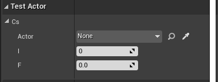
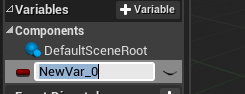
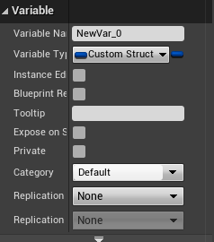

### UE 구조체

1. 일반적인 `c++` 구조체는 아래와같이 정의한다.

    ```cpp
    struct Potion
    {
    public:
        int recoveryHp;
        float cooltime;
        string potionName;
    }
    ```
2. 위에 처럼만 작성하면, 언리얼 에디터 , 블루프린터에서 사용이 불가하다. 사용하기 위해선 `UStructor`을 만들어야한다.
    - 블루 프린트에서 만든 구조체는 언리얼 내에서만 사용가능
    - `c++` 구조체는 코드와 블루프린트 양쪽에서 사용가능

3. 클래스 파일을 `None`형태로 생성하고, `C++` 코드에서 구조체를 만들기 위해선 먼저 헤더파일에 `#include "[FILE_NAME].generated.h"` 를 추가하고 아래와 같이 구조체를 작성한다.
    - 구조체의 이름은 F로 시작되게 작성해야한다.
    - `Atomic` : 이구조체가 항상 하나의 단위로 직렬화됨
    - `BluepintType` : 이 구조체가 블루프린트에서 사용될 수 있음
    - `Atomic`, `EditAnywhere` : 만약 이 구조체가 디테일 창에서 표시가되고, 수정 가능하
    - `BlueprintType` , `BlueprintReadWrite` : 구조체가 디테일 창에서는 보이지 않고, 코드 내부나 블루 프린트에서만 사용
    ```cpp
    #pragma once

    #include "CoreMinimal.h"
    #include "CustomStructs.generated.h"

    class MAKESTRUCT2_API CustomStructs
    {
    public:
        CustomStructs();
        ~CustomStructs();
    };

    USTRUCT(Atomic, BlueprintType)
    struct FCustomStruct
    {
        GENERATED_USTRUCT_BODY()
    public:
        UPROPERTY(EditAnywhere, BlueprintReadWrite)
            AActor* actor;
        UPROPERTY(EditAnywhere, BlueprintReadWrite)
            int32 i;
        UPROPERTY(EditAnywhere, BlueprintReadWrite)
            float f;
    };
    ```

4. 테스트를 해보기위해 액터 `c++` 클래스를 하나 더 생성해보자. 구조체를 정의한 헤더 파일을 명시하고, 사용한다.

    ```cpp
    ...

    #include "CustomStructs.h"
    ...

    class MAKESTRUCT2_API ATestActor : public AActor
    {
        ...

        UPROPERTY(EditAnywhere)
            FCustomStruct cs;
        
    };

    ```

5. 컴파일 후 생성한 액터를 끌어와서 디테일 탭을 확인해보면 다음과 같이 스트럭처 속성이 추가된 것을 확인할 수 있다.


    

6. 블루프린트에서도 생성한 스트럭처를 사용할 수 있다. 변수를 하나 생성하고, 변수 타입을 생성한 스트럭처 타입으로 명시한다. 
    
    

    


