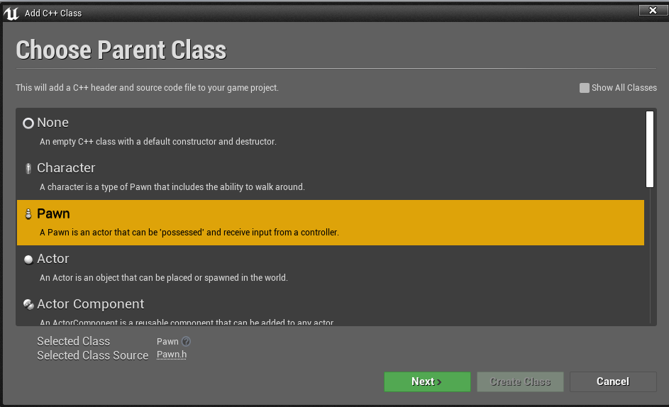
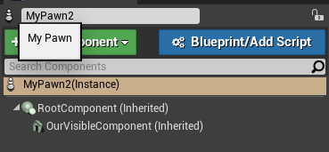
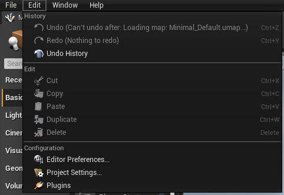
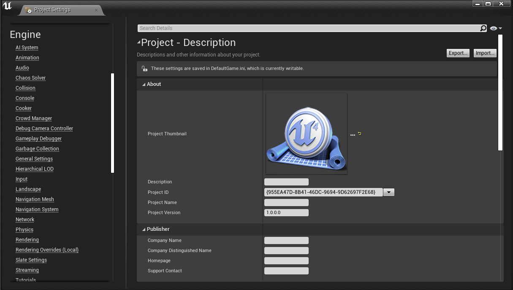
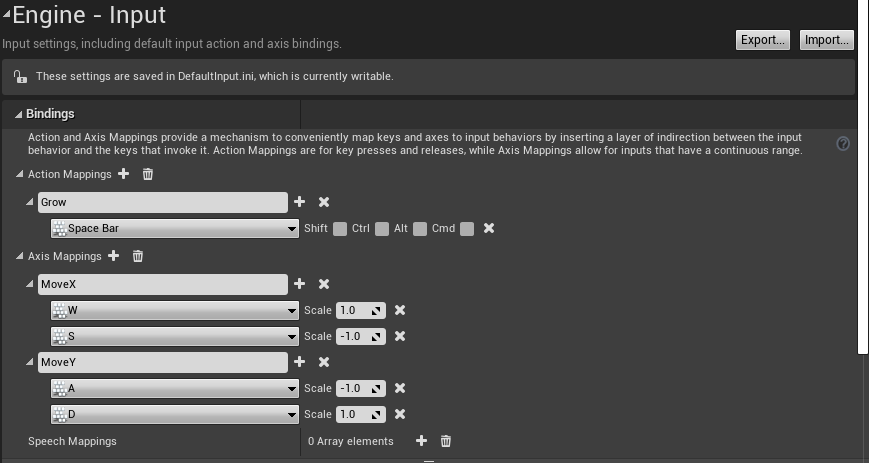
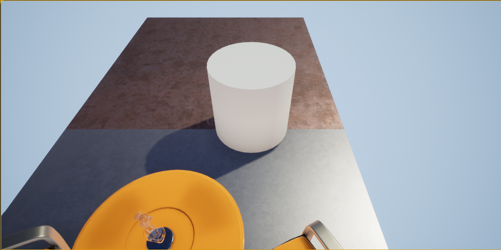
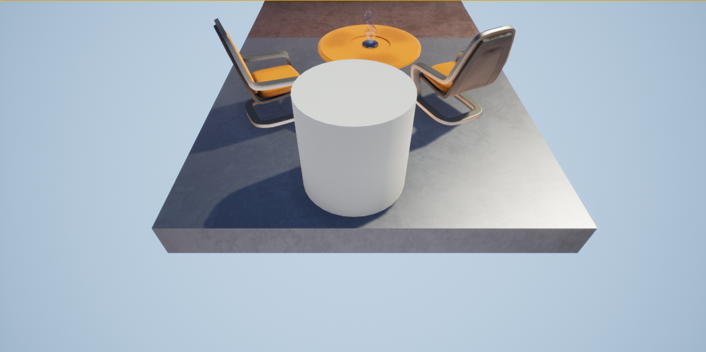

### 키보드 조작 및 Pawn

1. Pawn이란?
    - 플레이어나 Ai 의 컨트롤러가 연결되어 제어받을수 있도록 설계된 클래스를 의미

2. `C++`클래스를 `Pawn`을 상속받는 클래스로 생성한다.

    

3. 우리는 스페이스바를 누르는 동안 컴포넌트의 크기가 커지고, `W`,`A`,`S`,`D`키로 상하좌우 움직임이 가능하게끔 만들것이다. 보이는 것이 있어야 움직이는지 알수 있다. `OurVisibleComponent` 선언한다.

    ```cpp
        UPROPERTY(EditAnywhere)
        // 위치와 회전같은 transform 정보를 갖고 있다.
        USceneComponent* OurVisibleComponent;
    ```
4. `cpp` 파일에 생성자를 다음과 같이 작성한다.

    ```cpp
    AMyPawn::AMyPawn()
    {
        PrimaryActorTick.bCanEverTick = true;

        // 게임이 시작되면 자동으로 플레이어의 입력이 연결되도록
        AutoPossessPlayer = EAutoReceiveInput::Player0;

        RootComponent = CreateDefaultSubobject<USceneComponent>(TEXT("RootComponent"));

        UCameraComponent* OurCamera = CreateDefaultSubobject<UCameraComponent>(TEXT("OurCamera"));

        // 카메라 위치, 회전 벡터 설정
        OurCamera->SetupAttachment(RootComponent);
        OurCamera->SetRelativeLocation(FVector(-250.0f, 0.0f, 250.f));
        OurCamera->SetRelativeRotation(FRotator(-45.0f,0.0f,0.0f));

        // 메시 컴포넌트 추가

        OurVisibleComponent = CreateDefaultSubobject<UStaticMeshComponent>(TEXT("OurVisibleComponent"));
        OurVisibleComponent->SetupAttachment(RootComponent);
    }
    ```

5. 위와 같이 작성후 컴파일 하면 해당 Pawn 클래스의 디테일 탭이 다음과같이 뜬다. `OurVisibleComponent`을 선택해서 보이는 메쉬를 추가한다.

    

6. 이제 입력을 정의할 차례이다. 입력 매핑은 어떤 키를 조작했을 때에대한 정보를 얻기 위해서 그 키에대한 조작에 이름을 붙여주는 작업을 말한다. 입력매핑에는 두가지 방법이 있다.
    - 액션 매핑 : 마우스나 조이스틱, 키보드처럼 누르거나 떼거나 특정시간동안 누르고하는 입력.
        - 점프, 공격, 상호작용이 액션 매핑의 예시
    - 축 매핑 : 마우스의 위치나 조이스틱의 기울기 같은것으로 일정량의 입력.
        - 움직임이 없더라도 매 프레임 값을 보고 한다. 
        - 걷기, 달리기, 탈것 등의 방향 조절

7. 사진과 같이 `Edit` 탭에가서 `Project Settings`를 선택한다.

    

8. 왼쪽 탭에서 `Input`을 선택한다.

    

9. `Action Mapping` 과 `Axis Mapping`에 다음과 같이 추가한후 창을 닫는다.

    

10. 이제 Pawn이 매핑된 입력을 받아 움직이는 기능을 만들것이다. 코드로 돌아가서 헤더 파일에 조작 함수와 변수를 추가한다.

    ```cpp
	void Move_XAxis(float AxisValue);
	void Move_YAxis(float AxisValue);
	void StartGrowing();
	void StopGrowing();


	FVector CurrentVelocity;
	bool bGrowing;
    ```

11. ``cpp`` 코드에 조작 함수 내용을 적자.
    - Clamp 를 통해 AxisValue 값을 -1.0에서 1.0 사이의 값으로 제한, 만약에 방향키랑 w,a,s,d 키를 한꺼번에 누르면 값이 두배로 나올 수도 있기 때문

    ```cpp
    void AMyPawn::Move_XAxis(float AxisValue)
    {

        CurrentVelocity.X = FMath::Clamp(AxisValue, -1.0f, 1.0f) * 100.0f;

    }

    void AMyPawn::Move_YAxis(float AxisValue)
    {

        CurrentVelocity.Y = FMath::Clamp(AxisValue, -1.0f, 1.0f) * 100.0f;
    }

    void AMyPawn::StartGrowing()
    {
        bGrowing = true;
    }


    void AMyPawn::StopGrowing()
    {
        bGrowing = false;
    }
    ```

12. 함수와 입력 매핑을 연결시켜줘야한다. 이러한 작업을 함수와 입력을 묶는다는 의미로 바인딩한다고 말한다. 이는 `SetupPlayerInputComponent` 함수에서 해주겠다.


    ```cpp
    void AMyPawn::SetupPlayerInputComponent(UInputComponent* PlayerInputComponent)
    {
        Super::SetupPlayerInputComponent(PlayerInputComponent);


        // 그로우키를 누를때, 뗄때
        PlayerInputComponent->BindAction("Grow",IE_Pressed, this, &AMyPawn::StartGrowing);
        PlayerInputComponent->BindAction("Grow",IE_Released, this, &AMyPawn::StopGrowing);
        

        // 축 매핑

        PlayerInputComponent->BindAxis("MoveX", this, &AMyPawn::Move_XAxis);
        PlayerInputComponent->BindAxis("MoveY", this, &AMyPawn::Move_YAxis);

    }
    ```

13. 마지막으로 생성한 값을 실제 컴포넌트 위치 및 크기에 적용시켜준다. `Tick` 함수에서 해준다.

    ```cpp
    // Called every frame
    void AMyPawn::Tick(float DeltaTime)
    {
        Super::Tick(DeltaTime);

        // Grow 키에대한 반응 처리 작업
        {
            // 컴포넌트의 크기를 가져와서 bGrowing의 변수에 따라서 크기를 늘리고 줄인다.
            float CurrentScale = OurVisibleComponent->GetComponentScale().X;
            if(bGrowing)
            {
                CurrentScale += DeltaTime;
            }
            else
            {
                CurrentScale -= DeltaTime * 0.5f;
            }
            // 크기가 한꺼번에 커지는것 방지
            CurrentScale = FMath::Clamp(CurrentScale, 1.0f, 2.0f);
            OurVisibleComponent->SetWorldScale3D(FVector(CurrentScale));
        }

        // MoveX, MoveY 키로 변경된 CurrentVelocity 를 컴포넌트 위치에 적용시킨다.
        {
            if(!CurrentVelocity.IsZero())
            {
                FVector NewLocation = GetActorLocation() + (CurrentVelocity * DeltaTime);
                SetActorLocation(NewLocation);
            }
            
        }
    }
    ```

14. 컴파일 후 실행해보면 스페이스바를 누르는 동안 컴포넌트의 크기가 커지고, `W`,`A`,`S`,`D`키로 상하좌우 움직이는것을 확인할 수 있다.

    
    