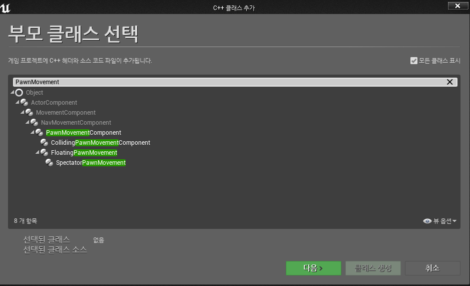

### Component & Collision

1. 컴포넌트를 붙여서 레벨을 돌아다니고, 다른 오브젝트와 충돌하게될 커스텀 pawn을 만들자. Pawn 클래스파일로 `CollidingPawn`을 생성한후, `CollidingPawn.cpp`에 생성자 함수`ACollidingPawn::ACollidingPawn()`에 아래 한줄한줄  추가한다. 먼저 아래의 코드들을 추가하기전에 헤더파일들을 추가해야한다.

    ```cpp
    #include <Engine/Classes/Components/SphereComponent.h>
    #include <Engine/Classes/Particles/ParticleSystemComponent.h>
    #include <Engine/Classes/GameFramework/SpringArmComponent.h>
    #include <Engine/Classes/Camera/CameraComponent.h>

    ...
    UParticleSystemComponent* OurParticleSystem;
    ```

    - 먼저 sphere 컴포넌트를 생성한다. 반경은 `40.f`이고, `SetCollisionProfileName`을 통해서 이 컴포넌트가 어떤 콜리전과의 충돌을 감지할지 설정한다.

    ```cpp
        USphereComponent* SphereComponent = CreateDefaultSubobject<USphereComponent>(TEXT("RootComponent"));
        RootComponent = SphereComponent;
        SphereComponent->InitSphereRadius(40.0f);
        // 이 컴포넌트가 가진 콜리전이 어떤 콜리전과의 충돌을 감지할 것인지를 설정하는 것.
        SphereComponent->SetCollisionProfileName(TEXT("Pawn"));
    ```

    - ``USphereComponent`` 는 구체의 물리 처리를 아는 컴포넌트로 충돌만 처리하고 실제 눈에 보이는 형태를 가지고 있지는 않다. 이 구체에 눈에 보이는 형태를 씌워준다.
    - `SphereVisualAsset`을 이용해 해당 경로의 메쉬 파일을 불러온다.

    ```cpp
        UStaticMeshComponent* SphereVisual = CreateDefaultSubobject <UStaticMeshComponent>(TEXT("VisualRepresentation"));
        SphereVisual->SetupAttachment(RootComponent);
        static ConstructorHelpers::FObjectFinder<UStaticMesh> SphereVisualAsset(TEXT("/Game/StarterContent/Shapes/Shape_Sphere.Shape_Sphere"));
    ```

    - 메쉬 구를 불러오는것이 성공했다면, `SphereVisualAsset.Object`를 스태틱 매쉬로 설정하고, 위치와 월드좌표에서의 크기를 정한다.

    ```cpp
        if (SphereVisualAsset.Succeeded())
        {
            SphereVisual->SetStaticMesh(SphereVisualAsset.Object);
            SphereVisual->SetRelativeLocation(FVector(0.0f, 0.0f, -40.0f));
            SphereVisual->SetWorldScale3D(FVector(0.8f));
        }
    ```

    - 위와 비슷하게 파티클을 설정한다. 

    ```cpp
        OurParticleSystem = CreateDefaultSubobject<UParticleSystemComponent>(TEXT("OurParticleSystem"));
        OurParticleSystem->SetupAttachment(RootComponent);
        OurParticleSystem->bAutoActivate = false;
        OurParticleSystem->SetRelativeLocation(FVector(-20.0f, 0.0f, 20.0f));
        static ConstructorHelpers::FObjectFinder<UParticleSystem> ParticleAsset(TEXT("/Game/StarterContent/Particles/P_Fire.P_Fire"));

        if (ParticleAsset.Succeeded())
        {
            OurParticleSystem->SetTemplate(ParticleAsset.Object);
        }
    ```

    - `SpringArm`을 설정한다. 이는 카메라가 약간 느리게 따라가 캐릭터보다 약간 느리게 따라가는 기능, 벽을 뚫고 들어가지 않게 해주는 기능을 제공한다.

    ```cpp
        USpringArmComponent* SpringArm = CreateDefaultSubobject<USpringArmComponent>(TEXT("CameraAttachmentArm"));
        SpringArm->SetupAttachment(RootComponent);
        SpringArm->SetRelativeRotation(FRotator(-45.0f, 0.0f, 0.0f));
        // 따라가야할 타겟과의 거리
        SpringArm->TargetArmLength = 400.0f;
        // 스프링 암이 곧바로 따라가지 않고 천천히 따라갈 것인지
        SpringArm->bEnableCameraLag = true;
        // 따라가는 속도 지정
        SpringArm->CameraLagSpeed = 3.0f;
    ```

    - `SpringArm`에 부착할 카메라를 생성한다.

    ```cpp
        // 부착할 카메라 생성

        UCameraComponent* Camera = CreateDefaultSubobject<UCameraComponent>(TEXT("ActualCamera"));
        Camera->SetupAttachment(SpringArm, USpringArmComponent::SocketName);

        OurMovementComponent = CreateDefaultSubobject<UCollidingPawnMovementComponent>(TEXT("OurMovementComponent"));
        OurMovementComponent->UpdatedComponent = RootComponent;
    ```

    - 자동으로 취하는 플레이어가 기본 플레이어이도록 설정
    
    ```cpp
        AutoPossessPlayer = EAutoReceiveInput::Player0;
    ```

2.  컴파일 후 아래와 같이 `PawnMovement` 클래스를 상속받는 클래스 `CollidingPawnMovementComponent`를 생성한다. 

    

    - `CollidingPawnMovementComponent.h`에 가상함수를 추가한다.

        ```cpp
        virtual void TickComponent(float DeltaTime, enum ELevelTick TickType, FActorComponentTickFunction* ThisTickFunction) override;
        ```

    - `CollidingPawnMovementComponent.cpp`에 가상함수를 추가한다.

    - `PawnOwner` : 이컴포넌트를 소유하고 있는 pawn
    - `UpdatedComponent` : `UPawnMovementcomponent` 클래스의 부모클래스인 `UMovementComponent` 에 속하는 변수로, 이 `MovementComponent`가 이동시키고 업데이트해야할 컴포넌트
    - `ShouldSkipUpdate(DeltaTime)` : 이동된 컴포넌트가 이동할 수 없거나 렌더링되지않은 경우인지 판별하여 알려주는 함수로 무브먼트 컴포넌트가 이동가능한지 확인해주는 조건문

        ```cpp
        void UCollidingPawnMovementComponent::TickComponent(float DeltaTime, enum ELevelTick TickType, FActorComponentTickFunction* ThisTickFunction)
        {
            Super::TickComponent(DeltaTime, TickType, ThisTickFunction);

            // 이동 처리 코드 작성

            if (!PawnOwner || !UpdatedComponent || ShouldSkipUpdate(DeltaTime))
            {
                return;
            }

            // ConsumeInputVector()을 이용해서 입력된 이동 벡터를 가져오고, 
            FVector DesiredMovementThisFrame = ConsumeInputVector().GetClampedToMaxSize(1.0f) * DeltaTime * 150.f;
            if (!DesiredMovementThisFrame.IsNearlyZero())
            {
                FHitResult Hit;

                // SafeMoveUpdatedComponent로 언리얼 엔진 피직스를 이용해서 장애물을 피해 폰무브먼트컴포넌트를 이동시켜준다.
                SafeMoveUpdatedComponent(DesiredMovementThisFrame, UpdatedComponent->GetComponentRotation(), true, Hit);

                if (Hit.IsValidBlockingHit())
                {
                    // 만약 컴포넌트가 이동하다가 충돌이 발생하면, SlideAlongSurface함수를 이용해서 제자리에 멈추는 대신 충돌체에 표면을 타고 미끄러지듯이 이동하도록 만들었다.
                    SlideAlongSurface(DesiredMovementThisFrame, 1.0f -Hit.Time, Hit.Normal, Hit);
                }
            }
        }
        ```


3. `CollindingPawn`이 `CollidingPawnMovementComponent`를 소유하고 사용하도록 만들어줘야한다. `CollidingPawnMovementComponent` 클래스를 완성했으므로, `CollidingPawn.cpp` 에 `CollidingPawnMovementComponent.h` 를 추가한다.
    
    ```cpp
    #include "CollidingPawnMovementComponent.h"
    ```

4.  `CollidingPawn.h` 에 ``MovementComponent` 관련 함수 및 변수를 추가한다.
    - `pawn class` 의 `GetMovementComponent` 를 재정의하기 위해 가상 함수로 선언한다.
    - 언리얼엔진에 다른 클래스가 폰이 사용중인 폰무브먼트 컴포넌트에 접근할 때 사용된다. 이것을 우리가 만든 무브먼트 컴포넌트를 가져가서 사용하도록 만들어야한다.
    
    ```cpp
    virtual UPawnMovementComponent* GetMovementComponent() const override
    ```

    - 해당 함수의 내용은 다음과 같이 작성한다.

    ```cpp
    UPawnMovementComponent* ACollidingPawn::GetMovementComponent() const
    {
        return OurMovementComponent;
    }
    ```

    - 움직임 함수 및 파티클 액티브 함수를 헤더에 선언한다.

    ```cpp
	void MoveForward(float AxisValue);

	void MoveRight(float AxisValue);

	void Turn(float AxisValue);

	void ParticleToggle();
    ```

    - 함수 내용은 다음과 같이 작성한다.

    ```cpp
    void ACollidingPawn::MoveForward(float AxisValue)
    {
        if (OurMovementComponent && (OurMovementComponent->UpdatedComponent == RootComponent))
        {
            OurMovementComponent->AddInputVector(GetActorForwardVector() * AxisValue);
        }
    }

    void ACollidingPawn::MoveRight(float AxisValue)
    {
        if (OurMovementComponent && OurMovementComponent->UpdatedComponent == RootComponent)
        {
            OurMovementComponent->AddInputVector(GetActorRightVector() * AxisValue);
        }
    }

    void ACollidingPawn::Turn(float AxisValue)
    {
        FRotator NewRotation = GetActorRotation();
        NewRotation.Yaw += AxisValue;
        SetActorRotation(NewRotation);
    }

    void ACollidingPawn::ParticleToggle()
    {
        if (OurParticleSystem && OurParticleSystem->Template)
        {
            OurParticleSystem->ToggleActive();
        }
    }
    ```


5. 함수와 입력 매핑을 바인딩하는 코드를 `SetupPlayerInputComponent()`를 작성한다.

    ```cpp
    void ACollidingPawn::SetupPlayerInputComponent(UInputComponent* PlayerInputComponent)
    {
        Super::SetupPlayerInputComponent(PlayerInputComponent);

        // 함수와 입력 매핑 바인딩하는 코드 작성

        InputComponent->BindAction("ParticleToggle", IE_Pressed, this, &ACollidingPawn::ParticleToggle);

        InputComponent->BindAxis("MoveForward", this, &ACollidingPawn::MoveForward);
        InputComponent->BindAxis("MoveRight", this, &ACollidingPawn::MoveRight);
        InputComponent->BindAxis("Turn", this, &ACollidingPawn::Turn);

    }
    ```


6. 컴파일 후 실행한후, pawn을 끌어다와서 실행시켜보자.

    