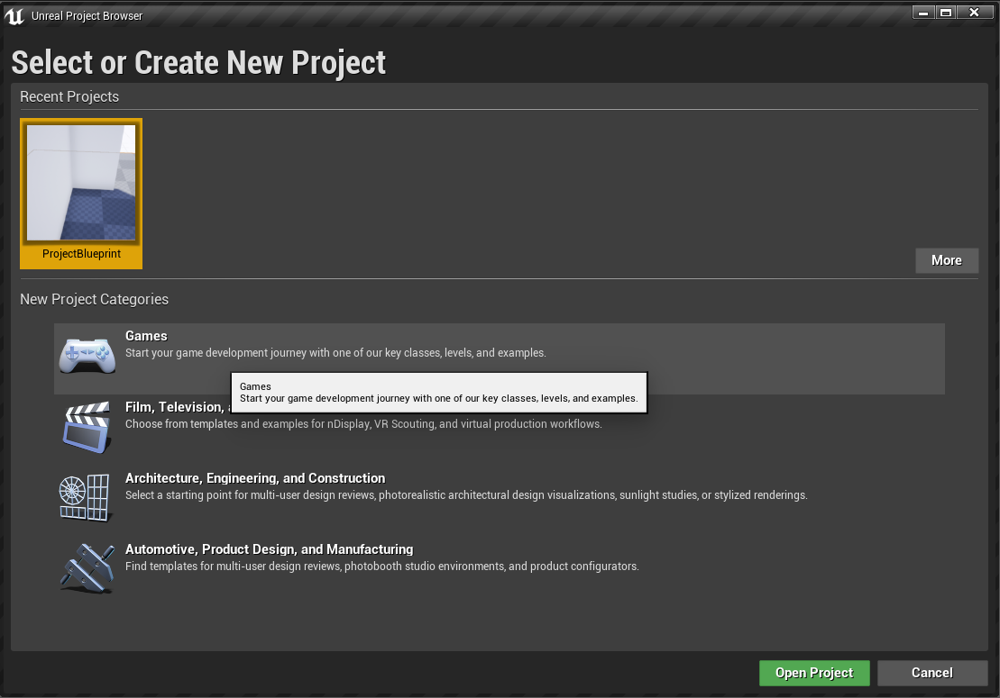

## Unreal tutorial-2

- 해당 내용은 [Unreal tutorial 02](https://www.youtube.com/watch?v=_zoyaVdqHQ8&feature=youtu.be)를 바탕으로 만들었습니다.
- 리눅스에서 진행하고 있습니다.

### 목차

1. 파일 설정
2. 실행 방법
3. 뷰포트 조작법
4. 메쉬(starter_package에서) 꺼내기
5. 메쉬 움직이기 및 추가 작업
6. 블루 프린터 생성 및 노드 생성

**우리의 목표는 집을 제작하고 실행시키자마자,집안의 조명이 켜지는 것이다.**

### 1. 파일 설정

1. 터미널에 ``cd ~/UnrealEngine_4.24/Engine/Binaries/Linux && ./UE4Editor``을 입력해서 실행시킨다.
2. 게임을 클릭하고, 블루프린트 탭에서 삼인칭, starter_package를 선택하고 알맞은 경로와 이름으로 저장한다.
    
    

### 2. 실행 방법

1. 실행시키면 아래와 같은 화면이 뜬다. 새로운 맵을 제작하기 위해 ``File`` 탭에서 ``New level``을 선택한다.

    
    

2. ``Default``를 선택하면 아래와 같은 화면이 뜬다.

    

3. 상단의 플레이 버튼을 누르면 캐릭터나 카메라의 실제 조작이 가능하다.
    

### 3. 뷰포트 조작 방법

1. 뷰포트를 움직여보자.
2. 뷰포트 조작 방법은 ``마우스의 우측 버튼``을 누른 상태로 진행한다.
3. `W`,`A`,`S`,`D` 키를 통해 상하 좌우 움직임이 가능하고, `Q`와 `E`키를 통해 높낮이 조절이 가능하다..!

### 4. 메쉬 꺼내기

1. 처음에 선택한 스타터 패키지에서 메쉬를 꺼내써보자..! ~~메쉬라면,, 나중에 블랜더에서도 불러올수 있을까..?~~
2. 아래 하단 탭에서 ``Content>StarterContent>Architecture``에 들어간다.
    
3. 여러 메쉬들이 보이는데, `Wall Door 400x300`을 선택해서 드래그한다.

### 5. 메쉬 움직이기 및 추가 작업

1. 메쉬를 원하는 위치에 놓기 위해선, 이동, 회전, 스케일 과 같은 방법을 이용할 수 있다.
2. 우측 탭에서 조절이 가능하지만, 더 쉬운 단축키들이 존재한다..!
3. 움직이고 싶은 메쉬를 클릭해서 이동은 ``W``, 회전은 ``E``, 스케일은 ``R``을 통해 가능하다.
4. 아니면 메쉬를 클릭한 후 `스페이스바`를 눌러서 변경이 가능하다..!
6. 추가적으로 선택한 메쉬를 복사하고 싶으면 , ``Alt``키를 누른상태로 드래그 한다~~고했지만 나한테서는 작동하지 않는다.~~
7. ``Ctrl``+``C`` 와 ``Ctrl``+``V``를 통해 복사 붙여넣기 후 이동 및 회전해서 사용하는 것도 가능하다.
8. 좌측 탭에서 ``Lights``를 클릭하고 드래그해서 조명을 가져온 후 올바른 위치에 놓는다.
    

### 블루 프린터 생성 및 노드 생성

1. 블루 프린트는 엔트리?같이 노드화해서 코드를 적게 쓸수 있게 해주는 비주얼 스크립팅 작업 툴이다.
2. 상단 탭에서 ``Blueprints``를 클릭하고, ``Open new level Blueprint``를 클릭하면 블루프린트 에디터 인터페이스가 열린다..!
    
3. 노드를 생성하기 전에! 우리는 시작하자마자 불이 켜질것이므로 디폴트로 조명을 꺼놓자 (우측 탭에서 ``Render>visibility``)
    

4. 블루 프린트 이벤트 그래프(모눈창)에서 그냥 우클릭하면, 모든 노드 리스트들이 뜬다.
5. 레벨에서 만든 조명을 클릭해놓은 상태로 이벤트 그래프에서 우클릭하면 가장위에 사용가능한? 추천하는 노드들이 뜬다. `Point Light` 레퍼런스 생성을 눌러서 라이트를 제어하는 노드를 추가합니다.
    

6. 해당 노드의 오른쪽 핀을 좌클릭한후 드래그 하면 선이 나온다. 그 상태에서 버튼을 떼면 마찬가지로 여러 선택지가 뜬다.
7. 거기서 ``visi``를 검색하면 나오는 ``Toggle Visibility``를 클릭해준다.
8. 기존에 있었던 ``BeginPlay event node``에 ``Toggle Visibility``를 연결해준다.

### 이제 끝! 실행시켜보자.

