## Unreal tutorial-3

- 해당 내용은 [Unreal tutorial 03](https://www.youtube.com/watch?v=gHdwOiR0D0A&feature=youtu.be)를 바탕으로 만들었습니다.
- 리눅스에서 진행하고 있습니다.
- **목표** : 캐릭터가 방안에 들어가면 방안 조명이 켜지고, 방 밖으로 나가면 조명이 꺼진다.

### 진행 순서

1. 먼저 이전에 방을 만들고, 조명을 만들었던 레벨을 가져온다. 

    

2. 해당 방 만큼의 볼륨을 만들고, 그 볼륨내에 위치하면 조명을 키고, 아니라면, 조명을 끄는 것으로 진행할 것이다.

3. 왼쪽 탭에 보면 많은 볼륨들이 존재한다. 하지만, 이번에는 `Basic` 탭에 있는 `Box Trigger`을 사용할 것이다.

    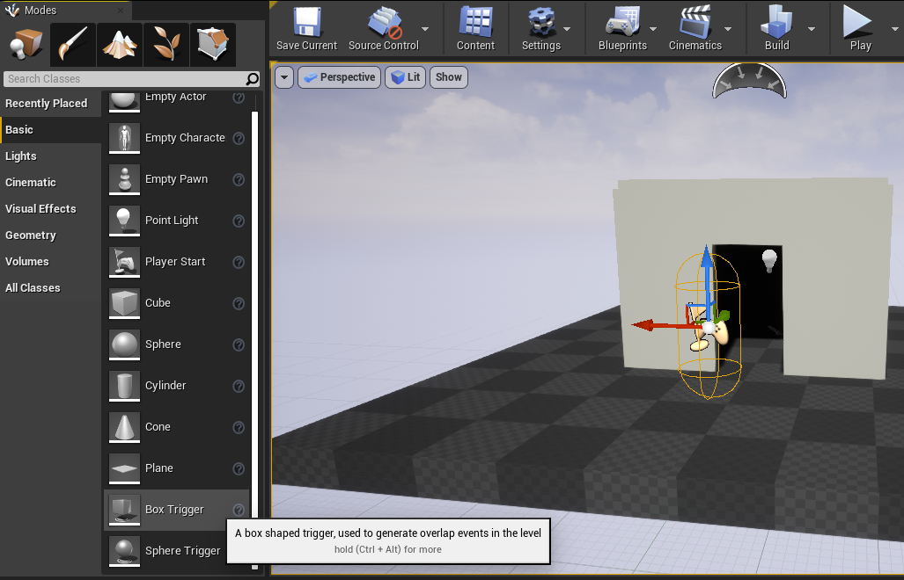

4. `Box Trigger`을 클릭해서 드래그 한뒤 이동, 스케일 등을 이용해서 박스가 해당 방안의 크기에 맞게끔 조절한다.

    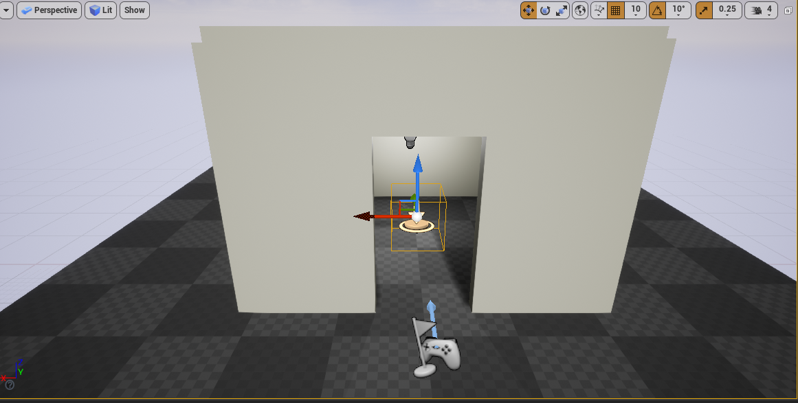
    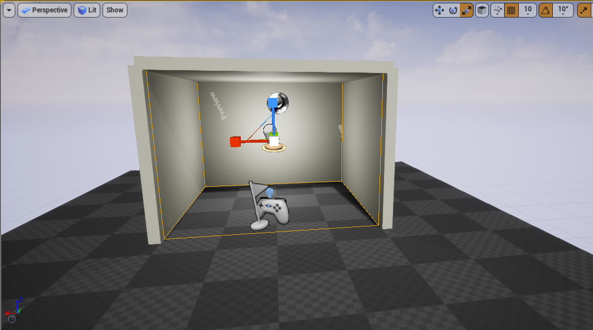
5. 블루 프린터 창을 켠다. 이전에 저장했던 노드들이 이벤트 그래프에 다음과 같이 보인다.

    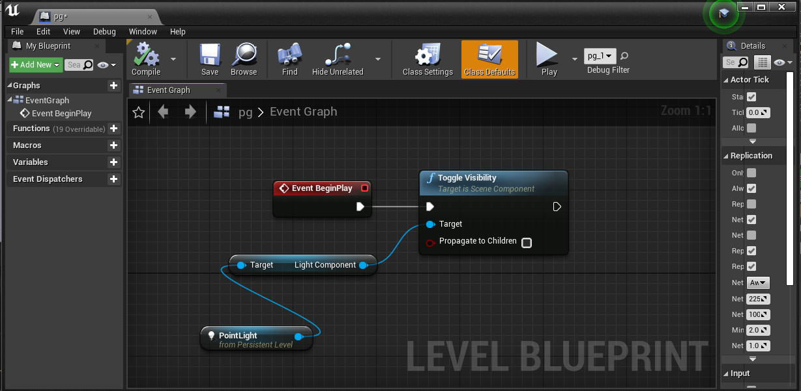
6. 레벨의 ``Box Trigger``을 클릭한 상태에서 이벤트 그래프 내에서 우클릭을 하면 다음과 같이 ``Add Event for Trigger Box 1``이라는 버튼이 나타난다.

    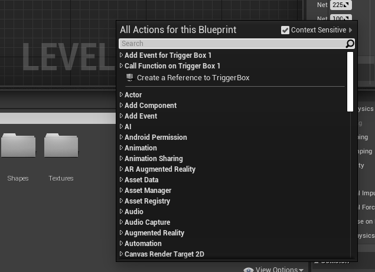

7. ``Add Event for Trigger Box 1 > Collision > Add On Actor Begin Overlap`` 을 클릭한다. ``On Actor Begin Overlap``은 해당 트리거 박스 내에 액터가 오버랩되기 **시작** 하면 이벤트를 발생시킨다.

    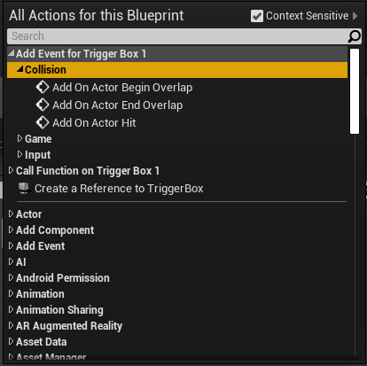

8. 아래의 사진과 같이 `Toggle Visibillity`에 연결 시킨다.

    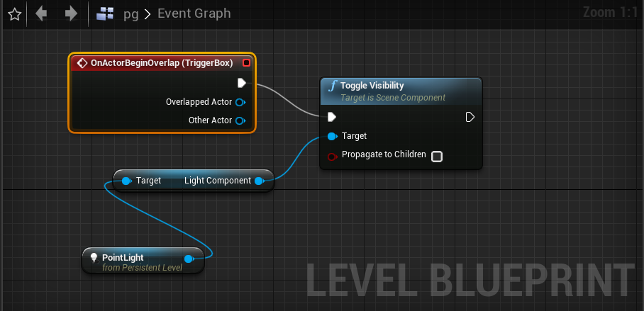

9. 이것만하면, 처음 들어 왔을 때 켜지고 나갔을때는 반응이 없다가, 다시 들어오면 조명이 꺼지는, 즉, 캐릭터가 방안에 들어왔을 때만 조명이 꺼졌다 켜졌다할 것이다. 방에서 나가는 순간을 추가해보자.

10. ``Add Event for Trigger Box 1 > Collision > Add On Actor End Overlap`` 을 클릭한다. ``On Actor End Overlap``은 해당 트리거 박스 내에 액터가 오버랩되는것이 **끝**이나면 이벤트를 발생시킨다.

    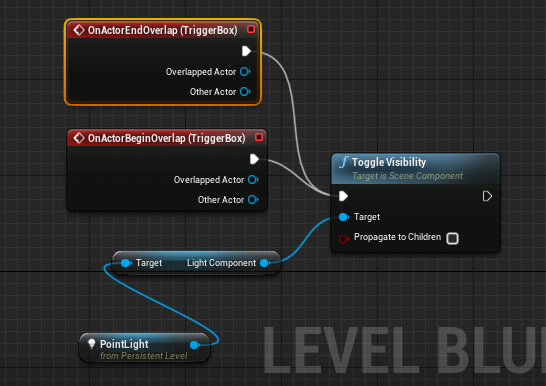
    
11. 사진처럼 들어오면 켜지고 나가면 꺼진다..!!

    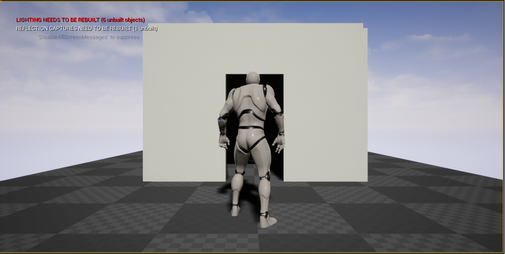
    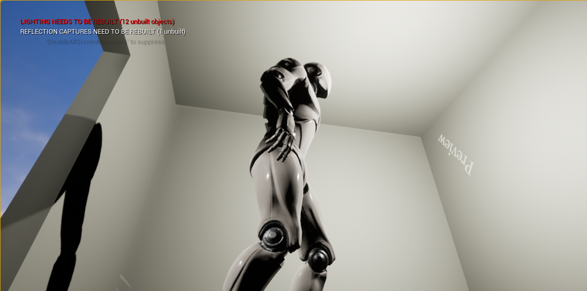
    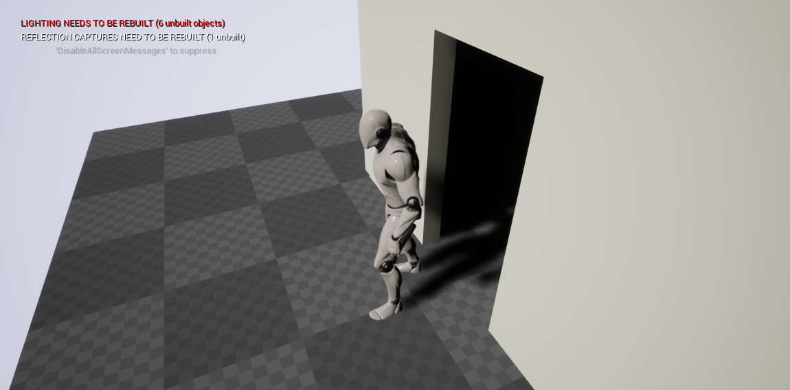

12. 들어오고 바로 켜지는게 아니라 딜레이를 줘보자!

    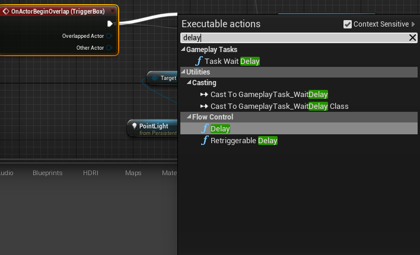
    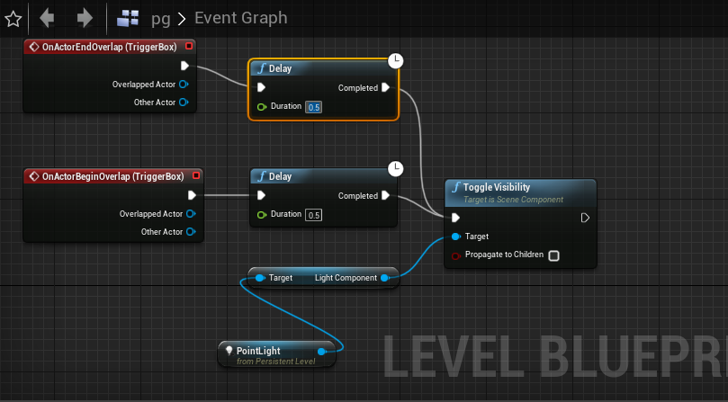

13. 완성된 데모 영상은 다음과 같다.

