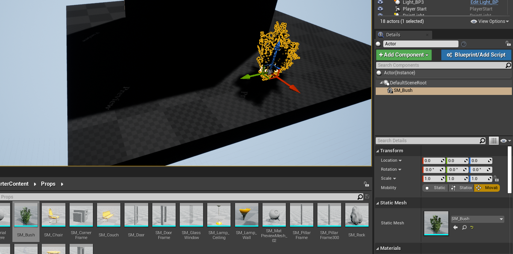

## Unreal tutorial-8

- 해당 내용은 아래의 영상들을 바탕으로 만들었습니다. 
    - [Unreal tutorial 08](https://www.youtube.com/watch?v=z1SD-d9yJmQ)
    - [Unreal tutorial 09](https://www.youtube.com/watch?v=mHfiAOlZZRQ) 

- 리눅스에서 진행하고 있습니다.
- **목표**
    1. 이전에는 블루프린트 클래스만을 사용했을 때는 공통된 여러개를 만들 수 는 있었지만, 각각의 유니크한 속성변경은 할 수 없었다. ~~레벨단에서는 독자적으로 바꿀수 없다~~
    2. Construction script를 이용해서 Blue print class를 레벨에서 사용할 때 각각을 독자적으로 바꿀 수 있게끔 만든다.
    3. 클래스 창에서 클래스를 생성 및 편집을 지금까지 했는데, 레벨 창에서 클래스를 생성 및 편집을 해보자.

### 진행 순서

1. 이전에 만들었던 `ligth_bp`에서 `Construction script`를 켜보자. 
2. 아래 사진처럼 창이 뜰 것이다. `get Spot Light`를 끌어오자.

    

3. `Set Light Color` 노드를 가져와서 연결한다. 이는 조명 색을 지정하는 노드이다. 

    

4. 파란 핀에 우클릭을 하면, 아래처럼 리스트가 표시된다. 여기서 ``Promote to Variable``을 클릭해서 색상 변수를 하나 생성한다.

    

5. ``Details``탭에 들어가서 ``Default Value``를 이전에 클래스에서 지정했던걸 그대로 가져오자.

    

6. 아래와 같이 노드가 표시된다. 변수 이름이 부정확하므로 ``Light Color``로 변경한다.

    

7. 레벨 창으로 다시 가면, 속성탭에 새롭게 ``Light Color``를 설정할 수 있다.

    

    

8. 이전에 설정했던 ``Light Color``은 디폴트로 노란색으로 되어있다. 원하는 색으로 바꿔주자.

    

    

9. 색깔을 지정을 할 수는 있지만, 클래스에서 디폴트가 ``no visibility`` 이기 때문에 색을 조정하는데 불편하다. 레벨단에서 조명을 켰다 껐다 할 수 있는 ``Visibility Setting`` 변수를 만들자.

    
    
    

10. 레벨 창에 블루 프린트 클래스를 생성해보자. `Empty Actor`를 드래그해서 가져온다. 스타터 패키지에서 부쉬를 가져와서 캐릭터가 가까이 오면 불이나는 액터를 만들어보자. 여기서 부시를 끌어올때 뷰포트가 아니라, 오른쪽 ``Add component`` 버튼 아래의 리스트 창에 끌어온다.

    
    

11. 가져온 ``SM_Bush``를 루트로 끌어온다.

    

12. ``Add component`` 버튼을 클릭해서 ``ParticleSystem``을 가져온다. 이는 폭발, 불 등의 효과를 보인다. 디폴트는 ``None``으로 되어있기 때문에 클릭해서 효과를 넣어준다.
    
    
    
    

13. 여기서는 `P_Fire`를 선택했다.

    

14. ``Auto Active``를 꺼주면 디폴트가 효과가 없는것으로 된다.

    

15. ``Add Component``를 통해 박스 트리거를 생성한다. 크기도 알맞게 변경하자.

    
    

16. 만들어 놓은것을 이제 ``Bluprint/Add Script``를 눌러서 클래스로 지정한다.

    

17. 경로를 알맞게 설정하고 저장한다.

    

18. 이벤트 그래프에서는 박스에 진입하면, ``Fire``의 변수를 ``Activate``한다.

    
    

19. 이제 만들었던 방? 집? 도 클래스로 묶어봅시다. ``Wall*``, ``TriggerBox``, ``PointLight``를 모두 선택한다.

    

20. 블루 브린트 버튼을 클릭해서 ``Convert Selected Components to Blueprint Class``를 선택한다.

21. 창은 아래와 같다..!

    

22. 이전에 레벨단에서 만들었던 노드를 클래스 창에서 다시 만들어주자.

    

23. 그대로 실행하면, 레벨 단에서 만들어 놓았던게 그대로 있어서, 컴파일 에러가 발생한다. 삭제해주자.

    

24. 실행해본다. 클래스로 생성해서 이렇게 다른 맵에서 가져와서 만들 수도 있다..!

    

